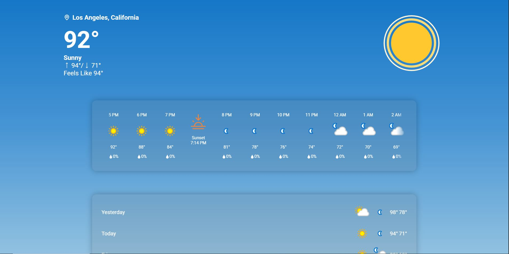

# Weather App

A modern, responsive weather app that provides current conditions, hourly forecasts, weather alerts, and more—optimized for desktop and mobile.

---

## Features

- **Current Weather:** Location-based temperature, condition, and "feels like" info.
- **Geolocation:** Automatically detects your current location (with permission) to show local weather and alerts.
- **Hourly Forecast:** Animated icons and precipitation details for upcoming hours.
- **Weather Alerts:** Displays active alerts for your area.
- **Weather Summary:** Quick view of yesterday, today, and upcoming days.
- **Detailed Metrics:** UV index, humidity, wind, dew point, pressure, and visibility.
- **Responsive Design:** Works beautifully on phones, tablets, and desktops.
- **Animated Icons:** Uses Lottie animations for dynamic weather visuals.
- **Saved Locations:** Quickly access your favorite places.
- **Search with Map:** Find weather for any location using an interactive map powered by [LeafletJS](https://leafletjs.com/).

---

## Location Detection

- The app uses the browser’s **Geolocation API** to detect your current location (if you allow permission).
- Your latitude and longitude are used to fetch local weather data and alerts from the weather API.
- You can also manually search for other locations using the interactive map.

---

## How the Map Works

- The app uses **LeafletJS** to display an interactive map on the search page.
- When you click or tap a location on the map, LeafletJS provides the **latitude and longitude** coordinates.
- These coordinates are then used to fetch weather data from the weather API, giving you accurate local forecasts and alerts.

---

## Screenshots



---

## Getting Started

### 1. Clone the Repository

```bash
git clone https://github.com/Manualliee/weather-app.git
cd weather-app
```

### 2. Install & Run Locally

You can use [Live Server](https://marketplace.visualstudio.com/items?itemName=ritwickdey.LiveServer) in VS Code, or run a simple Python server:

```bash
python -m http.server
```

Then open [http://localhost:8000](http://localhost:8000) in your browser.

---

## Hosting

This app is ready for static hosting on [Vercel](https://vercel.com/), [Netlify](https://www.netlify.com/), or [GitHub Pages](https://pages.github.com/).

---

## Technologies Used

- HTML5, CSS3 (with responsive design)
- JavaScript (ES Modules)
- [Lottie Web](https://github.com/airbnb/lottie-web) for animated icons
- [LeafletJS](https://leafletjs.com/) for interactive maps and location selection
- Weather API (specify which one you use, e.g., [WeatherAPI](https://www.weatherapi.com/))
- SVG icons from [SVGRepo](https://www.svgrepo.com/) and others

---

## Credits

- Weather data powered by [WeatherAPI](https://www.weatherapi.com/) (or your chosen API).
- Map powered by [LeafletJS](https://leafletjs.com/).
- Icons from [SVGRepo](https://www.svgrepo.com/).
- Lottie animations from [LottieFiles](https://lottiefiles.com/) and custom assets.

---

## License

This project is licensed under the MIT License.  
See the [LICENSE](LICENSE) file for details.

---

## Author

**Manuel Francisco Venegas**
